# My-500 Architecture Diagram

## System Overview

```mermaid
graph TB
    subgraph "Frontend (Next.js)"
        A[My500Page] --> B[My500Client]
        B --> C[ContactList]
        B --> D[SearchBar]
        B --> E[SyncButton]
        C --> F[ContactCard]
        F --> G[ActionButtons]
        F --> H[StatusIndicator]
    end
    
    subgraph "Backend (API Routes)"
        I[/api/my-500] --> J[getMy500Data]
        K[/api/pipedrive/sync] --> L[PipedriveSyncService]
        M[/api/activities] --> N[ActivityService]
    end
    
    subgraph "Database (Prisma)"
        O[(Users)] --> P[(Contacts)]
        O --> Q[(Activities)]
        O --> R[(SyncHistory)]
    end
    
    subgraph "External (Pipedrive)"
        S[Pipedrive API] --> T[Persons]
        S --> U[Organizations]
        S --> V[Activities]
    end
    
    A --> I
    E --> K
    G --> M
    J --> O
    L --> S
    N --> O
```

## Data Flow Architecture

### 1. Initial Load Flow

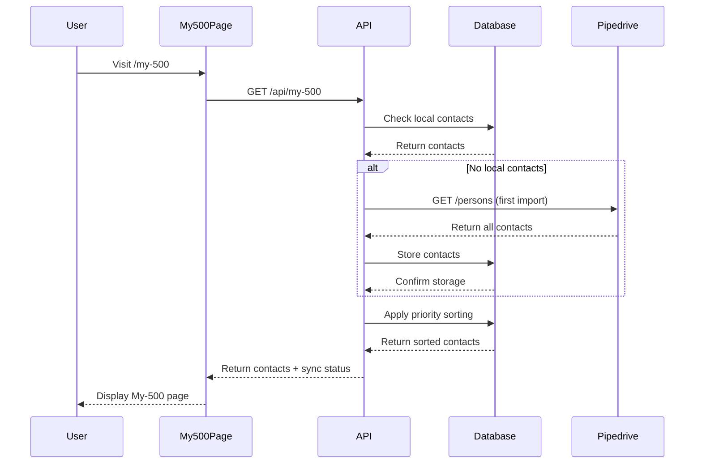

### 2. Incremental Sync Flow

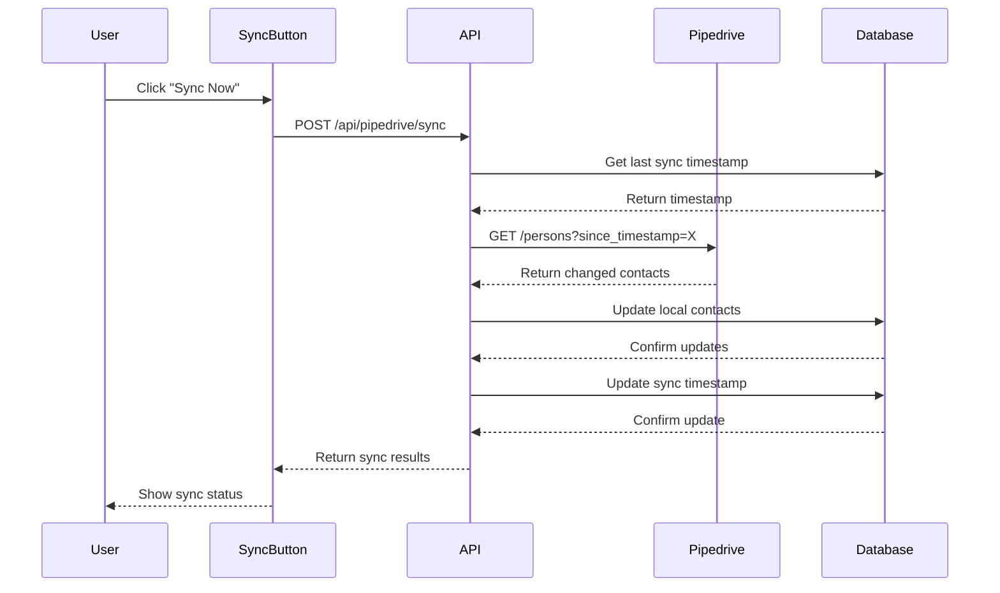

### 3. Action Flow

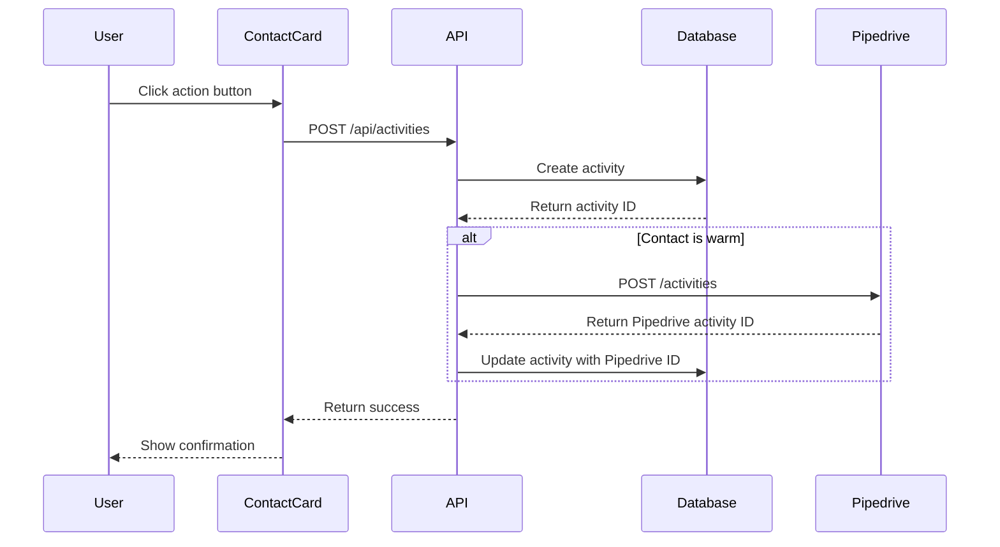

## Component Architecture

### Frontend Component Tree

```
My500Page (Server Component)
├── My500Client (Client Component)
│   ├── My500Header
│   │   ├── PageTitle
│   │   ├── ContactCount
│   │   ├── SyncButton
│   │   └── SyncStatus
│   ├── My500Search
│   │   ├── SearchInput
│   │   ├── FilterDropdown
│   │   └── SortOptions
│   ├── My500ContactList
│   │   ├── VirtualList
│   │   └── ContactCard[]
│   │       ├── ContactInfo
│   │       ├── StatusIndicator
│   │       ├── ActionButtons
│   │       └── ActivityIndicator
│   ├── ContactDetailSlideover
│   │   ├── ContactDetails
│   │   ├── ActivityHistory
│   │   └── ActionButtons
│   └── ActivityModal
│       ├── ActivityForm
│       └── CampaignSelector
```

### Backend Service Architecture

```
API Routes
├── /api/my-500
│   ├── getMy500Data()
│   ├── searchContacts()
│   └── getContactDetails()
├── /api/pipedrive/sync
│   ├── PipedriveSyncService
│   ├── ContactMatcher
│   └── SyncQueue
└── /api/activities
    ├── ActivityService
    ├── PipedriveActivitySync
    └── ActivityValidation
```

## Database Schema Architecture

### Entity Relationship Diagram

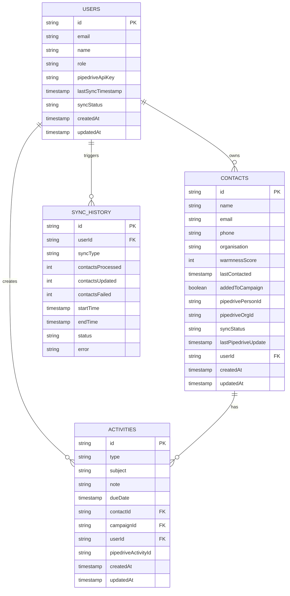

## Sync Architecture

### Sync Strategy Flow

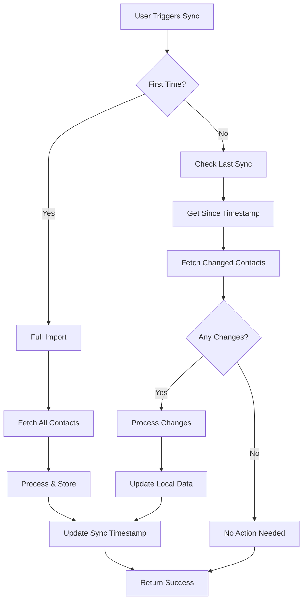

### Rate Limiting Architecture

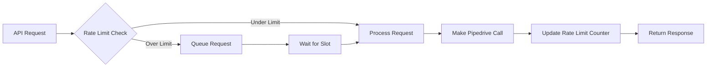

## Performance Architecture

### Caching Strategy

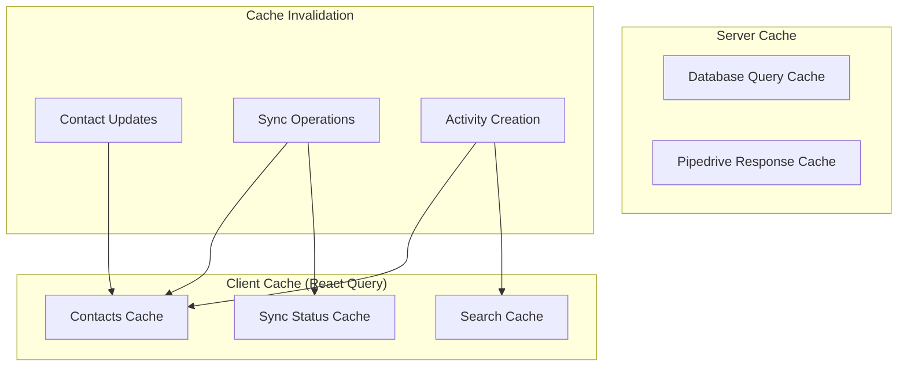

### Virtual Scrolling Architecture

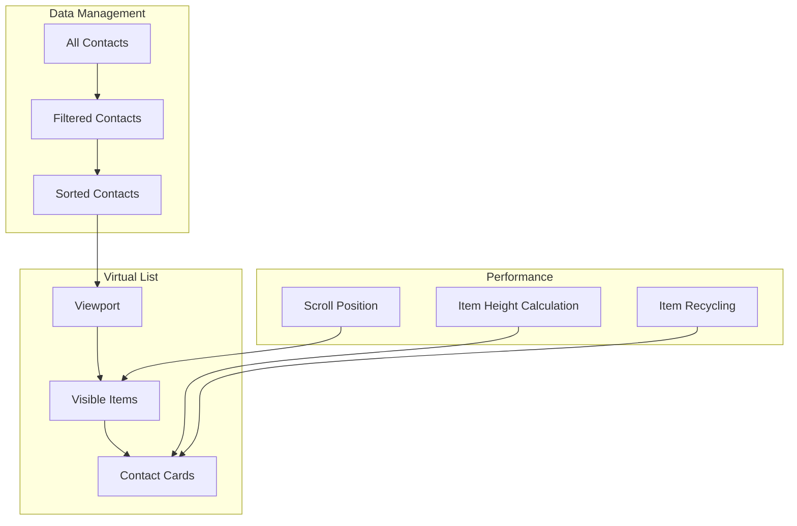

## Error Handling Architecture

### Error Flow

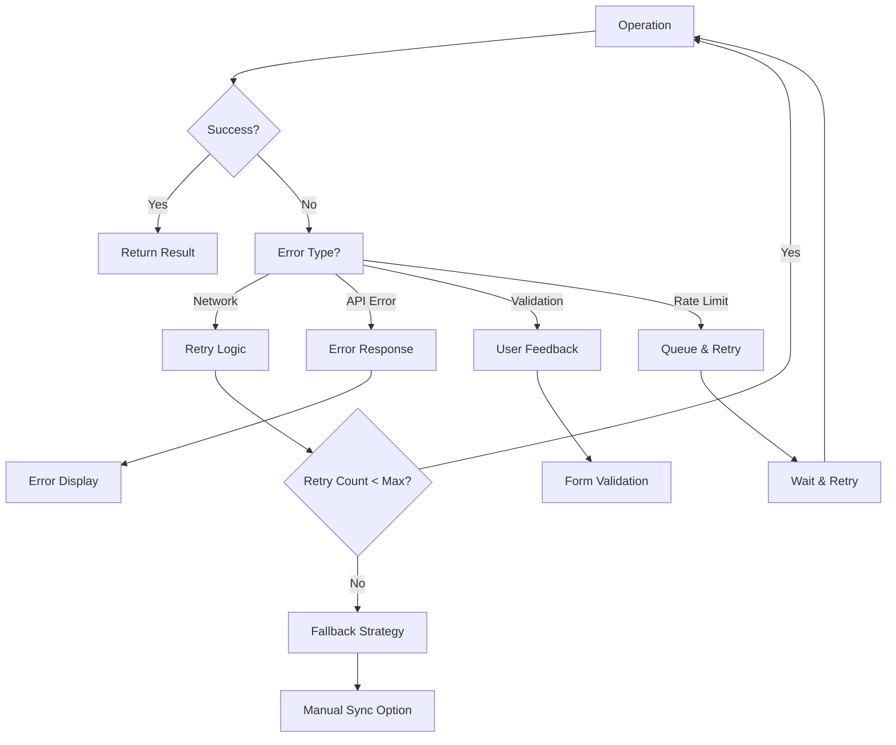

## Security Architecture

### Authentication & Authorization

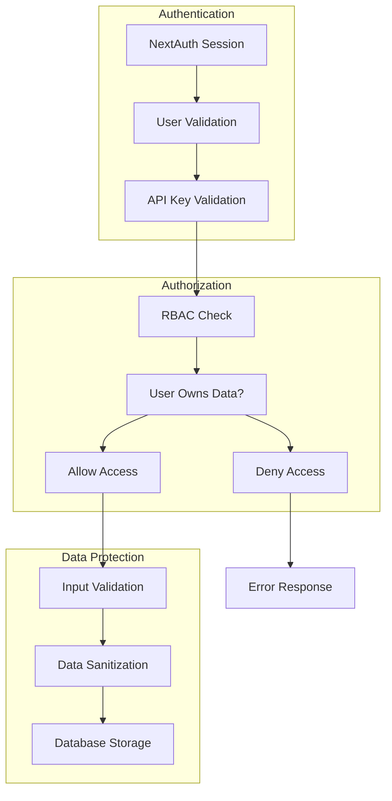

## Monitoring Architecture

### Metrics Collection

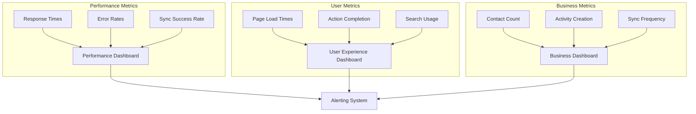

## Deployment Architecture

### Infrastructure

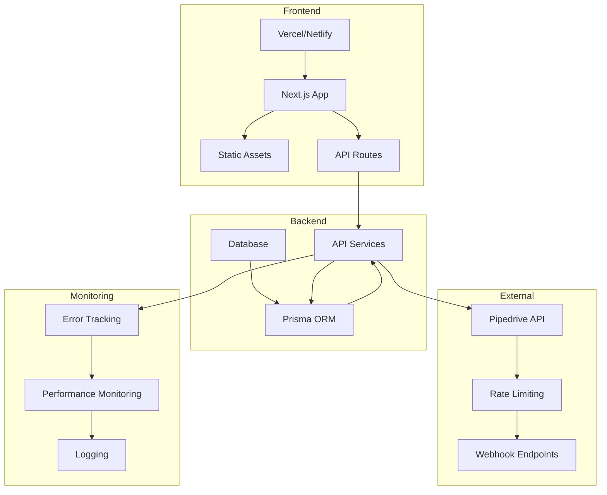

## Data Flow Summary

### Key Data Flows

1. **Contact Import Flow**
   - Pipedrive API → Local Database → Priority Sorting → UI Display

2. **Incremental Sync Flow**
   - Last Sync Timestamp → Changed Contacts → Local Updates → UI Refresh

3. **Action Flow**
   - User Action → Local Activity → Pipedrive Sync → UI Update

4. **Search Flow**
   - Search Input → Debounced Query → Filtered Results → UI Update

### Performance Optimizations

1. **Caching Strategy**
   - React Query for client-side caching
   - Database query optimization
   - Pipedrive response caching

2. **Virtual Scrolling**
   - Only render visible contacts
   - Efficient memory usage
   - Smooth scrolling performance

3. **Incremental Sync**
   - Only sync changed data
   - Reduced API calls
   - Faster sync times

4. **Rate Limiting**
   - Respect Pipedrive limits
   - Queue management
   - Exponential backoff

This architecture provides a robust, scalable, and performant foundation for the My-500 screen with full Pipedrive integration. 