# System Architecture Diagram

## High-Level Architecture

```mermaid
graph TB
    subgraph "Frontend (Next.js 14)"
        UI[User Interface]
        Components[React Components]
        Forms[Form Components]
        Tables[Data Tables]
    end

    subgraph "Backend (Next.js API Routes)"
        Auth[Authentication API]
        Campaigns[Campaigns API]
        Contacts[Contacts API]
        Activities[Activities API]
        PipedriveAPI[Pipedrive Integration API]
    end

    subgraph "Database Layer"
        Prisma[Prisma ORM]
        PostgreSQL[(PostgreSQL Database)]
    end

    subgraph "External Services"
        Pipedrive[Pipedrive API]
        Email[Email Service]
    end

    subgraph "Infrastructure"
        AuthProvider[NextAuth.js]
        Middleware[RBAC Middleware]
        Validation[Zod Validation]
    end

    UI --> Components
    Components --> Forms
    Components --> Tables
    
    Forms --> Auth
    Forms --> Campaigns
    Forms --> Contacts
    Forms --> Activities
    
    Tables --> Campaigns
    Tables --> Contacts
    Tables --> Activities
    
    Auth --> AuthProvider
    Campaigns --> Prisma
    Contacts --> Prisma
    Activities --> Prisma
    PipedriveAPI --> Pipedrive
    
    Prisma --> PostgreSQL
    
    AuthProvider --> Middleware
    Middleware --> Validation
    
    PipedriveAPI --> Email
```

## Data Flow Architecture

## Database Schema Relationships

## Component Architecture

## API Architecture

## Security Architecture

## Deployment Architecture

