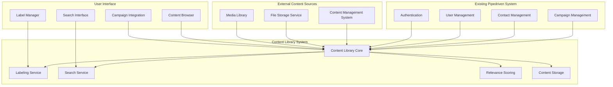
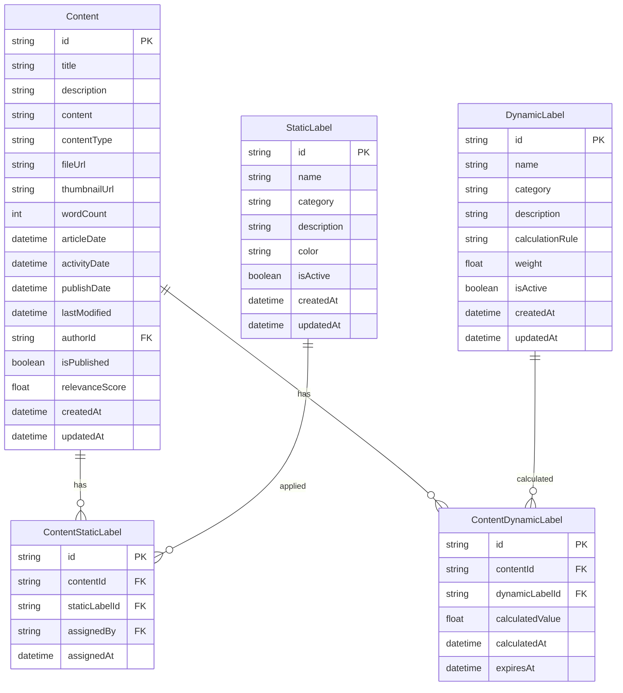

# Content Library System Design

## Executive Summary

The Content Library System is designed to support users in developing compelling pitches by providing access to a curated collection of organizational content including news articles, case studies, project summaries, white papers, and other relevant materials. The system employs a sophisticated labeling mechanism with both static (editor-assigned) and dynamic (system-generated) labels to enable intelligent content discovery and relevance scoring.

## System Overview

### Core Purpose
- Provide contextual access to organizational content for pitch development
- Enable intelligent content discovery through multi-dimensional labeling
- Support campaign-specific content recommendations
- Facilitate content relevance scoring and aging

### Key Features
- **Dual Labeling System**: Static labels (sector, type, topic) and dynamic labels (date-based aging)
- **Contextual Search**: Campaign-aware content discovery
- **Relevance Scoring**: Time-based content weighting with different aging profiles
- **Editorial Control**: Golden Ticket user management of static labels
- **Integration**: Seamless integration with existing campaign and contact systems

## Architecture Design

### High-Level System Architecture



### Data Model Architecture



## Core Components

### 1. Content Management

#### Content Types
- **News Articles**: Company news, industry updates, market insights
- **Case Studies**: Client success stories, project outcomes
- **White Papers**: Technical documents, research findings
- **Project Summaries**: Completed project overviews
- **Presentations**: Slide decks, pitch materials
- **Videos**: Recorded presentations, product demos
- **Infographics**: Visual content, charts, diagrams

#### Content Metadata
- Title, description, content body
- Author, article date, activity date, publish date, last modified
- File attachments, media links
- Word count, reading time
- Publication status

### 2. Labeling System

#### Static Labels (Editor-Assigned)
**Categories:**
- **Sector**: Technology, Healthcare, Finance, Manufacturing, etc.
- **Content Type**: News, Case Study, White Paper, Project Summary, etc.
- **Topic**: AI/ML, Digital Transformation, Cloud Migration, etc.
- **Client Size**: Enterprise, Mid-Market, SMB, Startup
- **Geographic Region**: UK, Ireland, Europe, Global
- **Industry Vertical**: Banking, Retail, Education, etc.
- **Technology Stack**: React, Node.js, AWS, Azure, etc.

**Management:**
- Golden Ticket users can create, edit, and assign static labels
- Color coding for visual organization
- Hierarchical label structure support
- Bulk label assignment capabilities

#### Dynamic Labels (System-Generated)
**Article Date Labels (News Articles):**
- **Breaking News** (0-1 week): Very high relevance, immediate impact
- **Recent News** (1-4 weeks): High relevance, current information
- **Current News** (1-3 months): Good relevance, recent developments
- **Recent History** (3-6 months): Moderate relevance, background context
- **Historical News** (6+ months): Reference material, historical context

**Activity Date Labels (Case Studies, White Papers, Project Summaries):**
- **Recent Activity** (0-3 months): Very high relevance, fresh experience
- **Current Activity** (3-6 months): High relevance, recent projects
- **Recent Experience** (6-12 months): Good relevance, recent expertise
- **Established Experience** (1-2 years): Moderate relevance, proven track record
- **Historical Experience** (2+ years): Reference material, long-term expertise

**Publish Date Labels (Content Library):**
- **Freshly Published** (0-1 month): High visibility, newly available
- **Recently Published** (1-3 months): Good visibility, current availability
- **Published** (3-6 months): Standard visibility
- **Established Content** (6-12 months): Lower visibility, established material
- **Legacy Content** (12+ months): Reference material, older content

### 3. Search and Discovery

#### Search Capabilities
- **Full-Text Search**: Content title, description, and body
- **Label-Based Filtering**: Filter by static and dynamic labels
- **Campaign Context**: Automatic relevance to current campaign
- **Contact Context**: Relevance to specific contact's profile
- **Date Range Filtering**: Time-based content discovery
- **Content Type Filtering**: Specific content format selection

#### Search Algorithms
- **Relevance Scoring**: Combines static and dynamic label weights
- **Date-Based Weighting**: Different aging profiles for different date types
- **Context Matching**: Campaign/contact alignment boosts scores
- **Semantic Search**: AI-powered content understanding

#### Search Interface
- **Faceted Search**: Sidebar with label categories
- **Search Suggestions**: Auto-complete and related searches
- **Saved Searches**: User-defined search configurations
- **Export Results**: Download search results for offline use

### 4. Campaign Integration

#### Campaign-Aware Content Discovery
- **Automatic Label Matching**: Match campaign sector/theme to content labels
- **Contact-Specific Recommendations**: Content relevant to campaign contacts
- **Campaign Timeline Integration**: Content appropriate for campaign stage
- **Competitive Intelligence**: Content about competitors or market trends

#### Content Relevance
- **Pitch Development**: Content relevant to pitch creation
- **Client Presentations**: Content appropriate for client meetings
- **Proposal Development**: Content suitable for proposal creation
- **Follow-up Materials**: Content for follow-up communications

### 5. Relevance Scoring Engine

#### Scoring Factors
- **Static Label Weight**: 50% of total score
  - Sector match: 20%
  - Content type relevance: 15%
  - Topic alignment: 10%
  - Client size match: 5%

- **Dynamic Label Weight**: 50% of total score
  - Article date relevance: 20% (for news articles)
  - Activity date relevance: 20% (for case studies, white papers, project summaries)
  - Publish date relevance: 10% (for all content types)

#### Scoring Algorithm
```
Total Score = (Static Score × 0.5) + (Dynamic Score × 0.5)

Static Score = Σ(Label Weight × Label Match Score)
Dynamic Score = (Article Date Score × 0.20) + 
                (Activity Date Score × 0.20) + 
                (Publish Date Score × 0.10)

// Date scores are calculated based on content type:
// - News articles: Article date aging profile
// - Case studies, white papers, project summaries: Activity date aging profile
// - All content: Publish date aging profile
```

## User Interface Design

### 1. Content Browser

#### Main Interface
- **Grid/List View Toggle**: Flexible content display options
- **Search Bar**: Prominent search with auto-complete
- **Filter Sidebar**: Collapsible label-based filtering
- **Sort Options**: Relevance, date, title, popularity
- **Bulk Actions**: Select multiple items for operations

#### Content Cards
- **Thumbnail**: Content preview image
- **Title & Description**: Clear content identification
- **Labels**: Visual label indicators with colors
- **Metadata**: Date, author, type, word count
- **Actions**: View, download, add to pitch, share

### 2. Label Management Interface

#### Static Label Manager
- **Label Categories**: Organized by label type
- **Label Creation**: Form for new label creation
- **Bulk Assignment**: Multi-select content and labels
- **Label Analytics**: Usage statistics and trends
- **Color Management**: Visual label customization

#### Dynamic Label Monitor
- **Label Calculations**: Real-time dynamic label generation
- **Rule Management**: Configuration of calculation rules
- **Weight Adjustment**: Fine-tune label importance
- **Performance Metrics**: System performance monitoring

### 3. Campaign Integration Interface

#### Campaign Content Panel
- **Relevant Content**: Auto-suggested content for campaign
- **Content Recommendations**: Suggested content based on campaign context
- **Pitch Builder**: Drag-and-drop content into pitches
- **Content Relevance**: Content relevance scores for campaign

#### Contact-Specific Content
- **Contact Profile**: Show content relevant to specific contact
- **Industry Match**: Content matching contact's industry
- **Role-Based Content**: Content appropriate for contact's role
- **Relevant Content**: Content relevant to contact's profile and history

## Technical Implementation Considerations

### 1. Database Design

#### New Tables Required
- `content`: Main content storage
- `static_labels`: Editor-assigned labels
- `dynamic_labels`: System-generated labels
- `content_static_labels`: Many-to-many relationship
- `content_dynamic_labels`: Calculated label values

#### Integration with Existing Tables
- Link to `campaigns` table for campaign context
- Link to `contacts` table for contact-specific content
- Link to `users` table for content ownership and usage
- Link to `organizations` table for industry-specific content

### 2. API Design

#### Content Management APIs
```
GET    /api/content                    # List content with filters
POST   /api/content                    # Create new content
GET    /api/content/:id                # Get specific content
PUT    /api/content/:id                # Update content
DELETE /api/content/:id                # Delete content
POST   /api/content/:id/labels         # Assign labels to content
```

#### Search APIs
```
GET    /api/content/search             # Search content
GET    /api/content/campaign/:id       # Campaign-relevant content
GET    /api/content/contact/:id        # Contact-relevant content
```

#### Label Management APIs
```
GET    /api/labels/static              # List static labels
POST   /api/labels/static              # Create static label
PUT    /api/labels/static/:id          # Update static label
GET    /api/labels/dynamic             # List dynamic labels
POST   /api/labels/dynamic             # Create dynamic label
```

### 3. Performance Considerations

#### Search Optimization
- **Full-Text Indexing**: PostgreSQL full-text search capabilities
- **Label Indexing**: Optimized queries for label-based filtering
- **Caching Strategy**: Redis caching for frequent searches
- **Pagination**: Efficient large result set handling

#### Content Storage
- **File Storage**: Cloud storage for large files (AWS S3, Azure Blob)
- **Thumbnail Generation**: Automated image processing
- **CDN Integration**: Fast content delivery
- **Compression**: Optimize storage and transfer

#### Scalability
- **Database Partitioning**: Partition by content type or date
- **Search Service**: Dedicated search service for complex queries
- **Background Processing**: Async label calculation and indexing
- **Load Balancing**: Distribute search and content delivery

### 4. Security and Access Control

#### Content Access Control
- **Role-Based Access**: Different permissions for different user roles
- **Content Ownership**: Content creators have full access
- **Sharing Controls**: Granular sharing permissions
- **Audit Trail**: Track all content access and modifications

#### Data Protection
- **Encryption**: Encrypt sensitive content at rest and in transit
- **Access Logging**: Comprehensive access logging
- **Data Retention**: Configurable content retention policies
- **Backup Strategy**: Regular content backup and recovery

## Integration with Existing Systems

### 1. Pipedriven Platform Integration

#### User Management
- Leverage existing user authentication and roles
- Extend user profiles with content preferences
- Integrate with existing Golden Ticket permissions

#### Campaign Integration
- Enhance campaign management with content recommendations
- Provide content relevance for campaign activities
- Support campaign-specific content discovery

#### Contact Integration
- Use contact industry and role information for content matching
- Provide contact-specific content recommendations
- Support contact-relevant content discovery

### 2. External System Integration

#### Content Management Systems
- **WordPress Integration**: Import content from WordPress sites
- **SharePoint Integration**: Connect to SharePoint document libraries
- **Google Drive Integration**: Import from Google Drive folders
- **Dropbox Integration**: Sync with Dropbox shared folders

#### Analytics Integration
- **Google Analytics**: Track content performance
- **Custom Analytics**: Internal usage analytics
- **A/B Testing**: Test content effectiveness
- **Performance Monitoring**: Monitor system performance

## Implementation Phases

### Phase 1: Core Content Management
- Basic content storage and management
- Simple static labeling system
- Basic search functionality
- User interface foundation

### Phase 2: Advanced Labeling
- Dynamic label calculation engine
- Sophisticated relevance scoring
- Advanced search and filtering
- Label management interface

### Phase 3: Campaign Integration
- Campaign-aware content discovery
- Content relevance scoring
- Pitch builder integration
- Campaign-specific recommendations

### Phase 4: Advanced Features
- AI-powered content recommendations
- Advanced analytics and insights
- External system integrations
- Performance optimizations

## Success Metrics

### User Engagement
- Content search frequency per user
- Search query volume and patterns
- Content relevance scores
- Time spent in content library

### Content Effectiveness
- Content relevance to campaigns and contacts
- Content relevance scores
- User feedback and ratings
- Content discovery patterns

### System Performance
- Search response times
- Content delivery speed
- System uptime and reliability
- User satisfaction scores

## Conclusion

The Content Library System provides a comprehensive solution for organizational content management and discovery, specifically designed to support pitch development and campaign success. The dual labeling system ensures both editorial control and intelligent content relevance through date-based aging profiles, while the campaign integration enables contextual content discovery that enhances user productivity and pitch effectiveness.

The system's modular design allows for phased implementation while maintaining integration with the existing Pipedriven platform. The focus on user experience, performance, and scalability ensures the system can grow with organizational needs while providing immediate value to users in their pitch development process. 